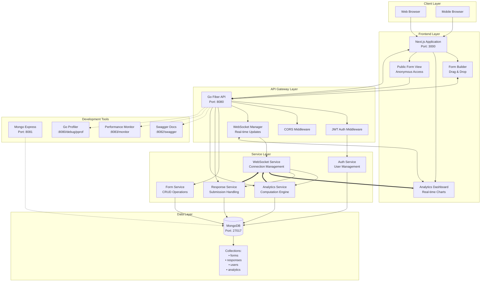

# System Component Diagram

## Overview

This document provides a detailed view of all system components, their relationships, and communication patterns in the Dune Form Analytics platform.

## High-Level Component Architecture

## Component Details

### Client Layer

#### Web Browser / Mobile Browser
- **Purpose**: User interface rendering and interaction
- **Responsibilities**: DOM manipulation, user input handling, HTTP/WebSocket communication
- **Technologies**: Modern browsers supporting ES6+, WebSocket API
- **Communication**: HTTP/HTTPS and WebSocket protocols to Next.js app

### Frontend Layer

#### Next.js Application
- **Location**: `apps/web/`
- **Port**: 3000
- **Purpose**: Main React application with server-side rendering
- **Key Features**:
  - Server-side rendering for improved performance
  - Client-side routing with Next.js App Router
  - TypeScript for type safety
  - Tailwind CSS for styling

**Dependencies**:
- Go Fiber API for data operations
- WebSocket connection for real-time updates

#### Form Builder Component
- **Location**: `apps/web/app/builder/`
- **Purpose**: Visual drag-and-drop form creation interface
- **Key Features**:
  - Drag-and-drop field management with @dnd-kit
  - Real-time form preview
  - Field validation configuration
  - Conditional logic setup

**Dependencies**:
- Form Service API for persistence
- WebSocket for collaborative editing (future)

#### Analytics Dashboard
- **Location**: `apps/web/app/forms/[id]/FormAnalytics.tsx`
- **Purpose**: Real-time visualization of form analytics and metrics
- **Key Features**:
  - Real-time chart updates via WebSocket
  - Multiple chart types (bar, line, pie)
  - Export functionality
  - Responsive design for mobile/tablet

**Dependencies**:
- Analytics Service API for historical data
- WebSocket Manager for live updates
- Recharts for data visualization

#### Public Form View
- **Location**: `apps/web/app/f/[slug]/`
- **Purpose**: Anonymous form submission interface
- **Key Features**:
  - Mobile-optimized responsive design
  - Client-side validation
  - Progress indicators
  - Conditional field display

**Dependencies**:
- Form Service API for form structure
- Response Service API for submissions

### API Gateway Layer

#### Go Fiber API
- **Location**: `apps/api/`
- **Port**: 8080
- **Purpose**: High-performance HTTP API server and WebSocket gateway
- **Key Features**:
  - RESTful API endpoints
  - WebSocket connection management
  - Middleware pipeline
  - Request/response validation

**Route Groups**:
- `/api/auth` - Authentication endpoints
- `/api/forms` - Form CRUD operations
- `/api/forms/:id/responses` - Response management
- `/api/forms/:id/analytics` - Analytics endpoints
- `/ws/forms/:id` - WebSocket connections

#### JWT Auth Middleware
- **Location**: `apps/api/internal/middleware/auth.go`
- **Purpose**: Authentication and authorization for protected routes
- **Key Features**:
  - JWT token validation
  - Token refresh handling
  - Role-based access control
  - Secure cookie management

#### CORS Middleware
- **Purpose**: Cross-Origin Resource Sharing configuration
- **Configuration**: Allows requests from `localhost:3000` in development
- **Security**: Restrictive origins in production

#### WebSocket Manager
- **Location**: `apps/api/internal/realtime/websocket.go`
- **Purpose**: Real-time communication hub for live analytics
- **Key Features**:
  - Connection lifecycle management
  - Room-based messaging (per form)
  - Event broadcasting
  - Connection statistics

### Service Layer

#### Form Service
- **Location**: `apps/api/internal/services/form_service.go`
- **Purpose**: Business logic for form operations
- **Responsibilities**:
  - Form CRUD operations
  - Validation rules enforcement
  - ShareSlug generation
  - Form publishing/unpublishing

**Key Methods**:
- `CreateForm()` - Create new form with validation
- `GetForm()` - Retrieve form by ID with ownership checks
- `UpdateForm()` - Update form fields and metadata
- `PublishForm()` - Make form publicly accessible

#### Response Service
- **Location**: `apps/api/internal/services/response_service.go`
- **Purpose**: Handle form response submission and retrieval
- **Responsibilities**:
  - Response validation against form schema
  - Anonymous submission handling
  - CSV export generation
  - Response aggregation for analytics

**Key Methods**:
- `SubmitResponse()` - Process and store form submission
- `GetResponses()` - Retrieve paginated responses
- `ExportCSV()` - Generate CSV export of responses

#### Analytics Service
- **Location**: `apps/api/internal/services/analytics_service.go`
- **Purpose**: Compute and serve form analytics and metrics
- **Responsibilities**:
  - Real-time analytics computation
  - Trend analysis and aggregation
  - Performance metrics calculation
  - WebSocket event broadcasting

**Key Methods**:
- `ComputeAnalytics()` - Calculate current form metrics
- `GetTrendAnalytics()` - Historical trend computation
- `BroadcastUpdate()` - Send real-time updates via WebSocket

#### Auth Service
- **Location**: `apps/api/internal/services/auth_service.go`
- **Purpose**: User authentication and session management
- **Responsibilities**:
  - User registration and login
  - Password hashing with bcrypt
  - JWT token generation and validation
  - Refresh token rotation

**Key Methods**:
- `Register()` - Create new user account
- `Login()` - Authenticate user and issue tokens
- `RefreshToken()` - Generate new access token
- `ValidateToken()` - Verify JWT token validity

#### WebSocket Service
- **Location**: `apps/api/internal/realtime/websocket.go`
- **Purpose**: Manage WebSocket connections and real-time messaging
- **Responsibilities**:
  - Connection authentication
  - Room management (form-specific channels)
  - Message broadcasting
  - Connection cleanup

### Data Layer

#### MongoDB Database
- **Location**: MongoDB container (port 27017)
- **Purpose**: Primary data storage for all application data
- **Configuration**:
  - Database: `dune_forms`
  - Authentication: Username/password with admin privileges
  - Connection pooling for concurrent access

#### Collections Structure
- **forms**: Form definitions, metadata, and configuration
- **responses**: Submitted form responses with metadata
- **users**: User accounts and authentication data
- **analytics**: Computed analytics and cached metrics

### Development Tools

#### Mongo Express UI
- **Port**: 8081
- **Purpose**: Web-based MongoDB administration interface
- **Features**: Database browsing, document editing, query execution
- **Access**: `admin`/`admin123` credentials

#### Swagger Documentation
- **Path**: `/swagger/index.html`
- **Purpose**: Interactive API documentation and testing
- **Features**: Complete API reference, request/response examples, authentication testing

#### Performance Monitor
- **Path**: `/monitor`
- **Purpose**: Real-time application performance metrics
- **Features**: Request rates, response times, memory usage, active connections

#### Go Profiler
- **Path**: `/debug/pprof`
- **Purpose**: Go runtime performance analysis and debugging
- **Features**: CPU profiling, memory analysis, goroutine inspection

## Communication Patterns

### HTTP REST Communication
- **Pattern**: Request/Response
- **Used For**: CRUD operations, authentication, data retrieval
- **Protocol**: HTTP/HTTPS with JSON payloads
- **Authentication**: JWT Bearer tokens for protected endpoints

### WebSocket Communication
- **Pattern**: Bi-directional messaging
- **Used For**: Real-time analytics updates, live collaboration
- **Protocol**: WebSocket over HTTP/HTTPS
- **Authentication**: Token-based authentication on connection

### Database Communication
- **Pattern**: Connection pooling with MongoDB driver
- **Used For**: Data persistence, querying, aggregation
- **Protocol**: MongoDB wire protocol
- **Features**: Automatic connection management, query optimization

## Error Handling and Resilience

### API Error Handling
- **HTTP Status Codes**: Proper status codes for different error types
- **Error Response Format**: Consistent JSON error responses
- **Validation Errors**: Detailed field-level validation messages
- **Logging**: Comprehensive error logging with context

### WebSocket Error Handling
- **Connection Failures**: Automatic reconnection with exponential backoff
- **Message Failures**: Error acknowledgments and retry mechanisms
- **Room Management**: Automatic cleanup of disconnected clients

### Database Error Handling
- **Connection Failures**: Connection pooling with health checks
- **Query Failures**: Proper error propagation and logging
- **Data Consistency**: Transaction support where needed

## Security Considerations

### API Security
- **Input Validation**: Comprehensive validation at API boundaries
- **Authentication**: JWT-based authentication with refresh tokens
- **Authorization**: Role-based access control
- **CORS**: Restrictive cross-origin policies

### WebSocket Security
- **Authentication**: Token validation on connection establishment
- **Origin Validation**: Verify connection origin
- **Message Validation**: Validate all incoming messages

### Database Security
- **Access Control**: Database user with minimal required privileges
- **Query Security**: Parameterized queries to prevent injection
- **Network Security**: Database access restricted to application containers

## Links for Nodes

- **Next.js Application** → [Frontend Overview](../frontend/overview.md)
- **Form Builder** → [Frontend Overview](../frontend/overview.md#form-builder)
- **Analytics Dashboard** → [Frontend Overview](../frontend/overview.md#analytics-dashboard)
- **Go Fiber API** → [Backend Overview](../backend/overview.md)
- **WebSocket Manager** → [WebSocket Documentation](../backend/websockets.md)
- **Form Service** → [Backend Overview](../backend/overview.md#service-layer-architecture)
- **Response Service** → [Backend Overview](../backend/overview.md#service-layer-architecture)
- **Analytics Service** → [Backend Overview](../backend/overview.md#service-layer-architecture)
- **Auth Service** → [Backend Overview](../backend/overview.md#service-layer-architecture)
- **MongoDB** → [Data Model](data-model.md)
- **Development Tools** → [README](../../README.md#tech-stack)

---

**Next Steps:**
- Explore [Data Model](data-model.md) for detailed database schema
- Review [Sequence Diagrams](sequences/) for interaction patterns
- Check [Backend Overview](../backend/overview.md) for implementation details
