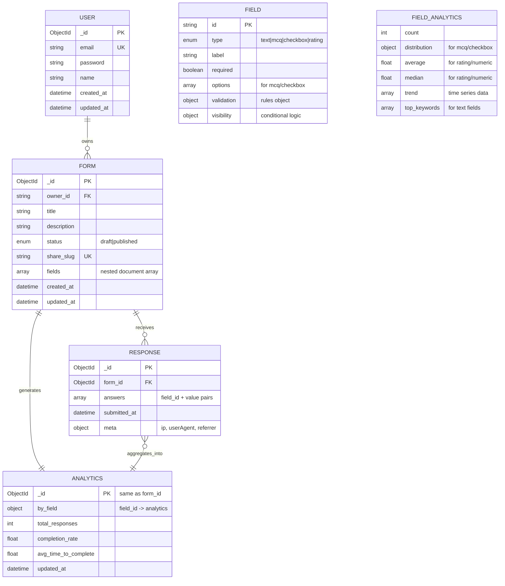

# Data Model & Database Schema

## Overview

Dune Form Analytics uses MongoDB as its primary database, storing data in four main collections: `forms`, `responses`, `users`, and `analytics`. The document-based structure provides flexibility for evolving form schemas while maintaining performance for analytics queries.

## Entity Relationship Diagram



## Collection Schemas

### Users Collection

**Purpose**: Store user account information and authentication data.

```json
{
  "_id": "ObjectId",
  "email": "user@example.com",
  "password": "$2a$12$hashed_password",
  "name": "John Doe",
  "created_at": "2024-01-01T00:00:00Z",
  "updated_at": "2024-01-01T00:00:00Z"
}
```

**Indexes**:
- `email`: Unique index for authentication lookups
- `created_at`: Index for user registration analytics

**Validation Rules**:
- Email must be valid format and unique
- Password minimum 6 characters (hashed with bcrypt)
- Name minimum 2 characters, maximum 50

### Forms Collection

**Purpose**: Store form definitions, metadata, and field configurations.

```json
{
  "_id": "ObjectId",
  "ownerId": "user_object_id",
  "title": "Customer Feedback Form",
  "description": "Please provide your feedback",
  "status": "published",
  "shareSlug": "customer-feedback-2024",
  "fields": [
    {
      "id": "field_1",
      "type": "text",
      "label": "Full Name",
      "required": true,
      "validation": {
        "minLen": 2,
        "maxLen": 100
      }
    },
    {
      "id": "field_2", 
      "type": "mcq",
      "label": "How satisfied are you?",
      "required": true,
      "options": [
        {"id": "opt_1", "label": "Very Satisfied"},
        {"id": "opt_2", "label": "Satisfied"},
        {"id": "opt_3", "label": "Neutral"},
        {"id": "opt_4", "label": "Dissatisfied"}
      ]
    },
    {
      "id": "field_3",
      "type": "rating",
      "label": "Rate our service",
      "required": false,
      "validation": {
        "min": 1,
        "max": 5
      }
    }
  ],
  "createdAt": "2024-01-01T00:00:00Z",
  "updatedAt": "2024-01-01T00:00:00Z"
}
```

**Indexes**:
- `ownerId`: Index for user-specific form queries
- `shareSlug`: Unique index for public form access
- `status`: Index for published forms filtering
- `createdAt`: Index for chronological ordering

**Field Types**:
- **text**: Single-line text input with optional validation
- **mcq**: Multiple choice (single selection) with predefined options
- **checkbox**: Multiple choice (multiple selections) with predefined options  
- **rating**: Numeric rating with min/max bounds

**Validation Options**:
- `minLen/maxLen`: String length constraints
- `min/max`: Numeric value constraints (rating fields)
- `pattern`: Regular expression validation (text fields)

### Responses Collection

**Purpose**: Store individual form submissions and associated metadata.

```json
{
  "_id": "ObjectId",
  "formId": "form_object_id", 
  "answers": [
    {
      "fieldId": "field_1",
      "value": "John Smith"
    },
    {
      "fieldId": "field_2", 
      "value": "opt_1"
    },
    {
      "fieldId": "field_3",
      "value": 4
    }
  ],
  "submittedAt": "2024-01-01T12:00:00Z",
  "meta": {
    "ip": "192.168.1.1",
    "userAgent": "Mozilla/5.0...",
    "referrer": "https://example.com"
  }
}
```

**Indexes**:
- `formId`: Index for form-specific response queries
- `submittedAt`: Index for chronological analytics queries
- `formId + submittedAt`: Compound index for time-range analytics

**Answer Value Types**:
- **Text fields**: String values
- **MCQ fields**: Option ID string (single value)
- **Checkbox fields**: Array of option ID strings
- **Rating fields**: Numeric values (1-10 range)

### Analytics Collection

**Purpose**: Store pre-computed analytics data for fast dashboard loading.

```json
{
  "_id": "form_object_id",
  "byField": {
    "field_1": {
      "count": 150,
      "topKeywords": [
        {"keyword": "excellent", "count": 23},
        {"keyword": "good", "count": 18}
      ]
    },
    "field_2": {
      "count": 150,
      "distribution": {
        "opt_1": 75,
        "opt_2": 45,
        "opt_3": 20,
        "opt_4": 10
      }
    },
    "field_3": {
      "count": 120,
      "average": 3.8,
      "median": 4.0,
      "trend": [
        {
          "date": "2024-01-01T00:00:00Z",
          "value": 3.5,
          "count": 25
        }
      ]
    }
  },
  "totalResponses": 150,
  "completionRate": 0.85,
  "averageTimeToComplete": 180,
  "updatedAt": "2024-01-01T12:00:00Z"
}
```

**Analytics Computation**:
- **Real-time updates**: Triggered on each response submission
- **Background jobs**: Full recomputation for data consistency
- **Incremental updates**: Efficient updates for high-volume forms

## Data Relationships

### User → Forms (One-to-Many)
- Each user can own multiple forms
- Forms are filtered by `ownerId` for user-specific views
- Cascade considerations: Forms become orphaned if user is deleted (soft delete recommended)

### Form → Responses (One-to-Many)
- Each form can receive unlimited responses
- Responses are anonymous (no user association)
- High-volume relationship requiring efficient indexing

### Form → Analytics (One-to-One)
- Each form has exactly one analytics document
- Analytics document `_id` matches the form `_id`
- Analytics are computed from associated responses

### Responses → Analytics (Many-to-One Aggregation)
- Multiple responses aggregate into single analytics document
- Real-time aggregation via MongoDB pipelines
- Historical trend data maintains time-series information

## Query Patterns

### Common Query Patterns

#### Form Management Queries
```javascript
// Get user's forms with pagination
db.forms.find({"ownerId": userId}).sort({"createdAt": -1}).limit(10)

// Get public form by slug  
db.forms.findOne({"shareSlug": slug, "status": "published"})

// Form search with text indexing (future enhancement)
db.forms.find({$text: {$search: "feedback survey"}})
```

#### Response Queries
```javascript
// Get responses for analytics computation
db.responses.find({"formId": formId}).sort({"submittedAt": 1})

// Get responses in date range
db.responses.find({
  "formId": formId,
  "submittedAt": {
    $gte: startDate,
    $lte: endDate
  }
})

// Count responses per day (aggregation)
db.responses.aggregate([
  {$match: {"formId": formId}},
  {$group: {
    "_id": {$dateToString: {format: "%Y-%m-%d", date: "$submittedAt"}},
    "count": {$sum: 1}
  }}
])
```

#### Analytics Queries
```javascript
// Get current analytics for dashboard
db.analytics.findOne({"_id": formId})

// Update field analytics (real-time)
db.analytics.updateOne(
  {"_id": formId},
  {
    $set: {"byField.field_1.count": newCount},
    $currentDate: {"updatedAt": true}
  }
)
```

### Performance Optimization

#### Indexing Strategy
```javascript
// Users collection
db.users.createIndex({"email": 1}, {"unique": true})
db.users.createIndex({"created_at": 1})

// Forms collection
db.forms.createIndex({"ownerId": 1, "createdAt": -1})
db.forms.createIndex({"shareSlug": 1}, {"unique": true})
db.forms.createIndex({"status": 1})

// Responses collection
db.responses.createIndex({"formId": 1, "submittedAt": -1})
db.responses.createIndex({"submittedAt": 1})

// Analytics collection (implicit _id index sufficient)
```

#### Aggregation Pipelines

**Response Distribution Analysis**:
```javascript
db.responses.aggregate([
  {$match: {"formId": ObjectId(formId)}},
  {$unwind: "$answers"},
  {$match: {"answers.fieldId": fieldId}},
  {$group: {
    "_id": "$answers.value",
    "count": {$sum: 1}
  }},
  {$sort: {"count": -1}}
])
```

**Trend Analysis Over Time**:
```javascript
db.responses.aggregate([
  {$match: {"formId": ObjectId(formId)}},
  {$group: {
    "_id": {
      "year": {$year: "$submittedAt"},
      "month": {$month: "$submittedAt"}, 
      "day": {$dayOfMonth: "$submittedAt"}
    },
    "count": {$sum: 1}
  }},
  {$sort: {"_id": 1}}
])
```

## Data Consistency & Integrity

### Referential Integrity
- **Form-Response Relationship**: Ensured through application logic
- **User-Form Ownership**: Validated on all form operations
- **Analytics Synchronization**: Maintained through event-driven updates

### Data Validation
- **Schema Validation**: MongoDB schema validation for required fields
- **Application Validation**: Go struct tags with validator library
- **Type Safety**: TypeScript interfaces matching Go structs

### Backup & Recovery Strategy
- **Point-in-time Recovery**: MongoDB replica set with oplog
- **Daily Backups**: Automated mongodump with retention policy
- **Data Export**: CSV export functionality for user data portability

## Migration Strategy

### Schema Evolution
- **Backward Compatibility**: New fields added as optional
- **Field Type Changes**: Handled through application logic with fallbacks
- **Index Modifications**: Background index creation to avoid downtime

### Data Migration Scripts
```javascript
// Example: Add new field to all forms
db.forms.updateMany(
  {"newField": {$exists: false}},
  {$set: {"newField": "defaultValue"}}
)

// Example: Recalculate all analytics
db.forms.find().forEach(function(form) {
  // Trigger analytics recomputation
  db.analytics.updateOne({"_id": form._id}, {$set: {"needsRecalc": true}})
})
```

## Security Considerations

### Data Protection
- **Password Hashing**: bcrypt with salt rounds for user passwords
- **PII Handling**: No personally identifiable information in responses metadata
- **Access Control**: User-based form ownership validation

### Database Security
- **Authentication**: MongoDB user with minimal required privileges
- **Network Security**: Database access restricted to application containers
- **Audit Logging**: MongoDB audit log for production environments

### GDPR Compliance Considerations
- **Data Minimization**: Collect only necessary response metadata
- **Right to Deletion**: Cascade delete responses when forms are deleted
- **Data Portability**: CSV export functionality for user data

---

**Next Steps:**
- Review [Sequence Diagrams](sequences/) for data flow patterns
- Explore [Backend Overview](../backend/overview.md#data-access-patterns) for technical details
- Check [API Documentation](../backend/api-rest.md) for data access patterns
