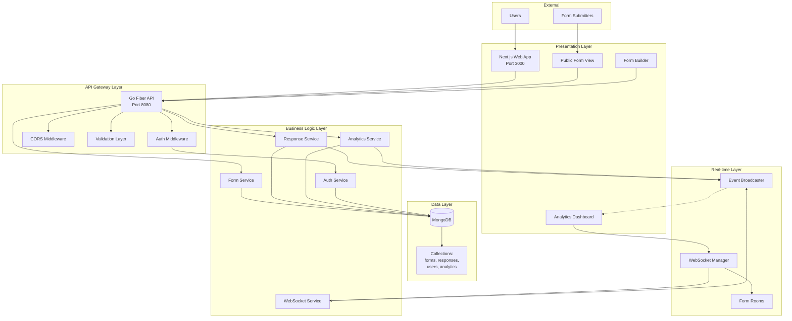
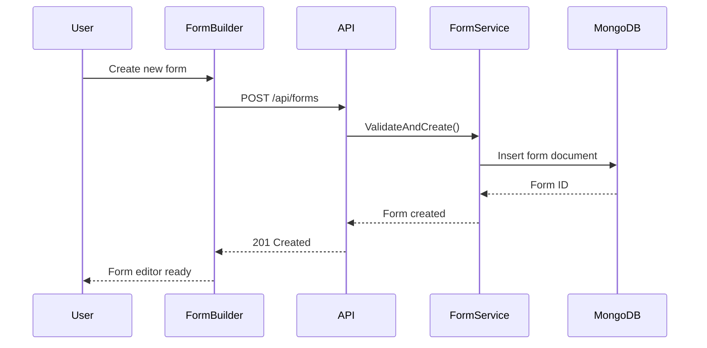
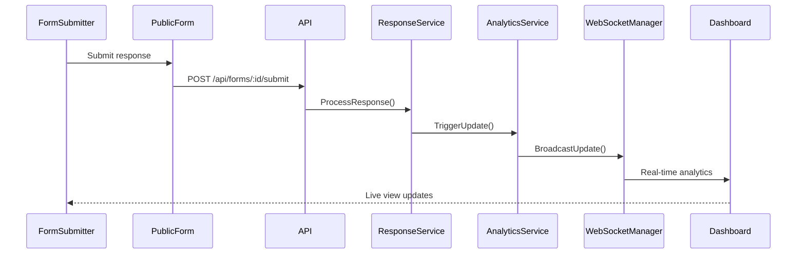
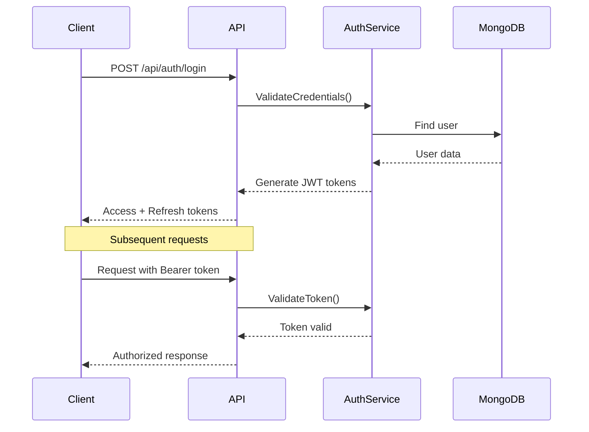

# System Architecture Overview

## Purpose & Design Principles

Dune Forms is a form builder with real-time analytics capabilities. The system follows clean architecture principles with separation between presentation, business logic, and data layers.

**Core Design Principles:**
- **Separation of Concerns**: Clear boundaries between frontend, API, and data layers
- **Real-time First**: WebSocket-driven architecture for live analytics updates
- **Security by Default**: JWT-based authentication with proper token management
- **Developer Experience**: Comprehensive development tools and monitoring
- **Performance Oriented**: Optimized for both build-time and runtime performance
- **Scalable Architecture**: Designed to handle growth in users and form complexity

## High-Level Architecture

## Technology Stack Rationale

### Frontend: Next.js + TypeScript
**Why Next.js:**
- Server-side rendering for better SEO and initial load performance
- Built-in API routes for backend integration
- Excellent developer experience with hot reloading
- Strong TypeScript integration

**Why TypeScript:**
- Type safety reduces runtime errors
- Better developer experience with IntelliSense
- Easier refactoring and maintenance
- Compile-time error catching

### Backend: Go + Fiber Framework
**Why Go:**
- Excellent performance for concurrent operations
- Strong standard library for web services
- Built-in support for WebSockets and HTTP/2
- Simple deployment (single binary)
- Excellent memory management

**Why Fiber Framework:**
- Express-like API familiar to developers
- Built-in middleware ecosystem
- WebSocket support out of the box
- Excellent performance benchmarks
- Active community and documentation

### Database: MongoDB
**Why MongoDB:**
- Flexible schema perfect for evolving form structures
- Native JSON support aligns with JavaScript/Go
- Excellent performance for read-heavy analytics workloads
- Strong aggregation pipeline for analytics computations
- Easy horizontal scaling when needed

## Core Components

### 1. Form Builder Service
- **Purpose**: Visual drag-and-drop form creation
- **Location**: `apps/web/app/builder/`
- **Key Features**: Field management, validation rules, conditional logic
- **Dependencies**: Form API, real-time updates via WebSocket

### 2. Analytics Engine
- **Purpose**: Real-time computation and visualization of form metrics
- **Location**: `apps/api/internal/services/analytics_service.go`
- **Key Features**: Response aggregation, trend analysis, live updates
- **Dependencies**: MongoDB aggregation pipeline, WebSocket broadcasting

### 3. WebSocket Manager
- **Purpose**: Real-time communication between clients and server
- **Location**: `apps/api/internal/realtime/websocket.go`
- **Key Features**: Room-based messaging, connection management, event broadcasting
- **Dependencies**: Fiber WebSocket middleware, Form services

### 4. Authentication System
- **Purpose**: Secure user management and API access control
- **Location**: `apps/api/internal/services/auth_service.go`
- **Key Features**: JWT tokens, refresh token rotation, role-based access
- **Dependencies**: bcrypt password hashing, MongoDB user storage

## Data Flow Patterns

### 1. Form Creation Flow

### 2. Real-time Analytics Flow

### 3. Authentication Flow

## Security Architecture

### Authentication & Authorization
- **JWT Access Tokens**: Short-lived (15 minutes) for API authentication
- **Refresh Tokens**: Long-lived (7 days) for token renewal
- **Role-based Access**: User roles control feature access
- **Secure Token Storage**: HTTPOnly cookies for refresh tokens

### Data Protection
- **Password Security**: bcrypt hashing with salt rounds
- **Input Validation**: Comprehensive validation at API boundaries
- **CORS Protection**: Configured for specific origins only
- **SQL Injection Prevention**: MongoDB parameterized queries

### Network Security
- **TLS Encryption**: All communication over HTTPS in production
- **WebSocket Security**: Origin validation and authentication checks
- **Rate Limiting**: Protection against brute force attacks (TODO: implement)

## Scalability Considerations

### Current Architecture Limits
- **Single MongoDB Instance**: Current setup suitable for moderate loads
- **In-Memory WebSocket State**: Limited to single server instance
- **No Caching Layer**: All data fetched from MongoDB on each request

### Future Scaling Opportunities
- **Database Scaling**: MongoDB replica sets and sharding
- **Redis Integration**: Caching frequently accessed forms and analytics
- **Load Balancing**: Multiple API server instances
- **WebSocket Scaling**: Redis pub/sub for multi-server WebSocket coordination

## Performance Characteristics

### Response Times (Development Environment)
- **Form Retrieval**: < 50ms average
- **Form Submission**: < 100ms average
- **Analytics Computation**: < 200ms for forms with < 1000 responses
- **WebSocket Message Latency**: < 10ms

### Resource Usage
- **Go API Memory**: ~50MB base, +1MB per 100 concurrent connections
- **MongoDB Storage**: ~1KB per form, ~500 bytes per response
- **Next.js Bundle Size**: ~2.5MB initial bundle, ~500KB per route

## Monitoring & Observability

### Built-in Monitoring
- **Health Checks**: `/health` endpoint with database connectivity
- **Performance Profiling**: `/debug/pprof` for Go runtime analysis
- **Application Metrics**: `/monitor` dashboard for real-time stats
- **API Documentation**: `/swagger` for interactive API exploration

### Logging Strategy
- **Structured Logging**: JSON format for machine processing
- **Log Levels**: DEBUG, INFO, WARN, ERROR with appropriate verbosity
- **Correlation IDs**: Request tracing across service boundaries
- **Error Tracking**: Comprehensive error context and stack traces

## Development Workflow

### Local Development
- **Docker Compose**: Complete environment with one command
- **Hot Reloading**: Both frontend and backend auto-reload on changes
- **Database UI**: Mongo Express for data inspection
- **API Testing**: Swagger UI for endpoint testing

### Code Organization
- **Monorepo Structure**: Frontend and backend in separate apps
- **Shared Types**: TypeScript interfaces matching Go structs
- **Clear Boundaries**: Well-defined interfaces between layers
- **Consistent Naming**: Standardized naming conventions across languages

## Deployment Architecture

### Development Environment
- **Docker Compose**: Local multi-container setup
- **Volume Mounting**: Live code reloading during development
- **Development Tools**: Swagger, profiler, and monitoring enabled
- **Database Seeding**: Sample data for testing

### Production Considerations (Future)
- **Container Orchestration**: Kubernetes or Docker Swarm
- **Environment Separation**: Separate configurations for staging/production
- **Secret Management**: External secret store integration
- **Backup Strategy**: Automated MongoDB backups

## Design Decisions

Key architectural decisions are documented throughout this documentation:
- **Technology Stack**: See [Tech Stack](../../README.md#tech-stack) for rationale
- **Authentication Strategy**: See [API Authentication](../backend/api-rest.md#authentication-endpoints)
- **Real-time Communication**: See [WebSocket Documentation](../backend/websockets.md)
- **Data Storage**: See [Data Model](data-model.md) for database design

---

**Next Steps:**
- Review [Component Diagram](component-diagram.md) for detailed service relationships
- Explore [Data Model](data-model.md) for database schema details
- Check [Sequence Diagrams](sequences/) for critical flow documentation
