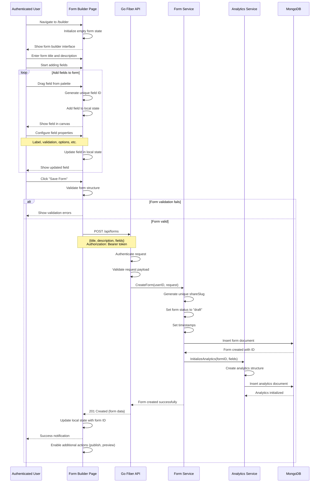
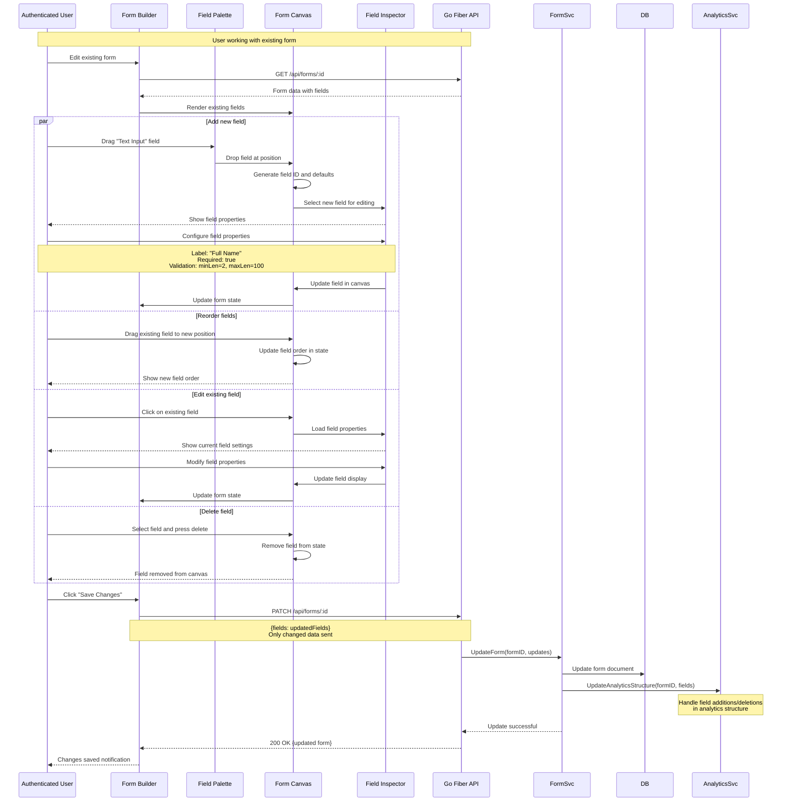
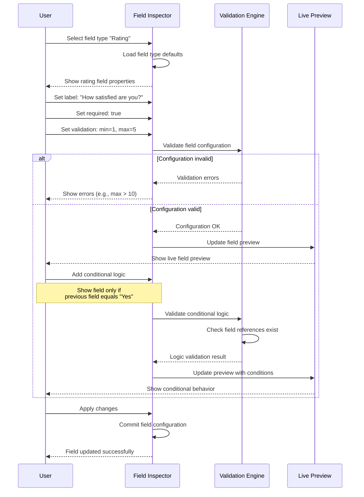
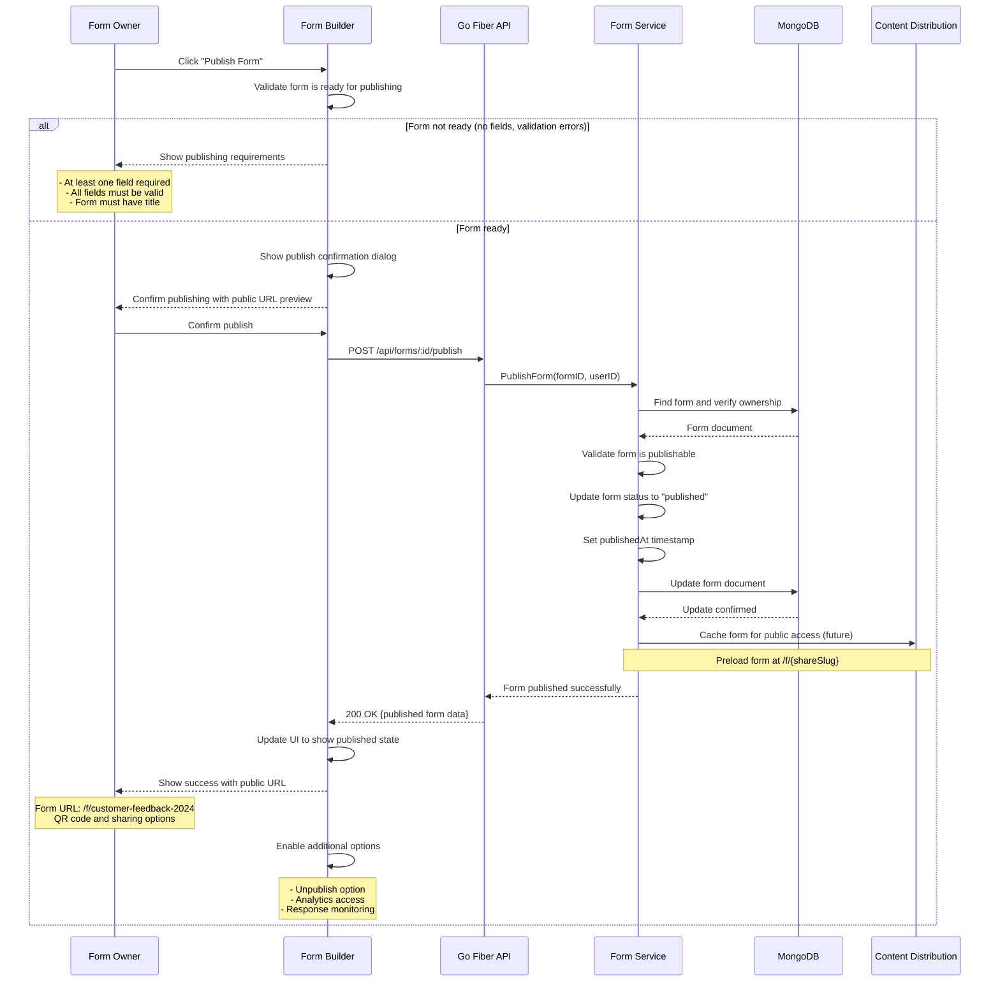
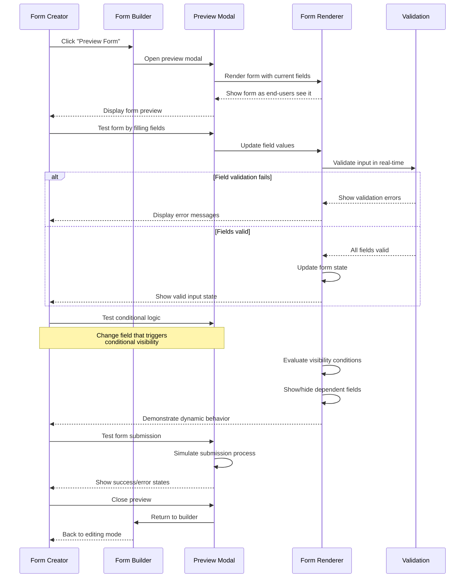
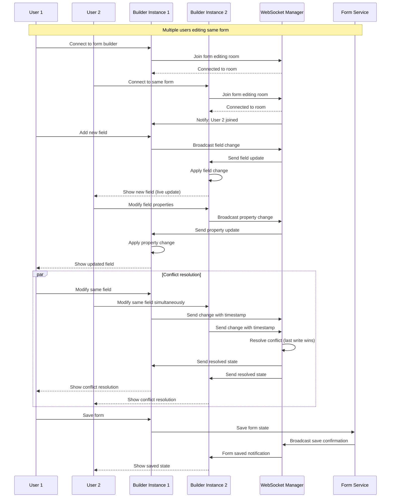

# Form Creation & Builder Flow

## Overview

This document describes the complete form creation workflow in Dune Form Analytics, from initial form creation to field management and form publishing using the drag-and-drop builder interface.

## Form Creation Flow

## Form Field Management

## Field Configuration Flow

## Form Publishing Flow

## Form Preview & Testing

## Real-time Collaboration (Future Enhancement)

## Performance Optimizations

### Builder Performance
- **Debounced Updates**: Avoid excessive API calls during rapid editing
- **Local State Management**: Immediate UI feedback before server sync
- **Field Virtualization**: Efficient rendering of forms with many fields
- **Undo/Redo Stack**: Client-side action history management

### Drag & Drop Optimization
- **Ghost Elements**: Lightweight drag previews
- **Drop Zone Highlighting**: Visual feedback during drag operations
- **Snap to Grid**: Consistent field positioning
- **Collision Detection**: Prevent overlapping field placement

### Form Validation
- **Schema Validation**: Compile-time validation for field configurations
- **Real-time Validation**: Immediate feedback on field changes
- **Dependency Tracking**: Efficient conditional logic evaluation
- **Validation Caching**: Cache complex validation results

## Error Handling

### Builder Error States
- **Network Errors**: Graceful handling of API failures
- **Validation Errors**: Clear field-level error messaging  
- **Conflict Resolution**: Handle simultaneous editing conflicts
- **Recovery Mechanisms**: Auto-save and recovery from crashes

### User Experience
- **Progressive Enhancement**: Graceful degradation without JavaScript
- **Accessibility**: Full keyboard navigation and screen reader support
- **Mobile Optimization**: Touch-friendly drag and drop
- **Loading States**: Clear progress indicators for all operations

---

**Related Documentation:**
- [Frontend Overview](../../frontend/overview.md#form-builder) - Frontend implementation details
- [Backend Overview](../../backend/overview.md#service-layer-architecture) - Backend service logic
- [API Documentation](../../backend/api-rest.md#form-management-endpoints) - Complete API reference
