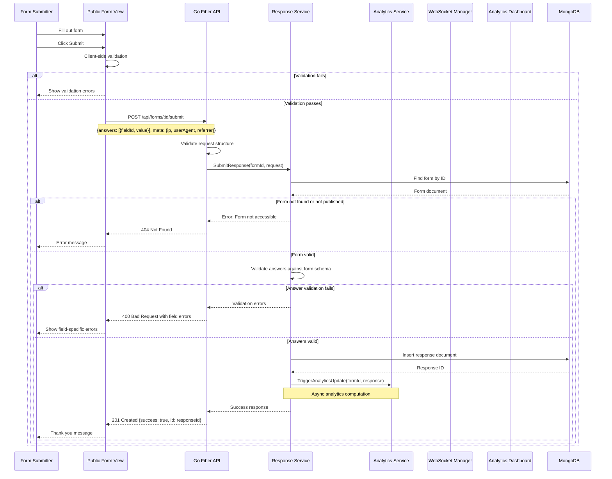
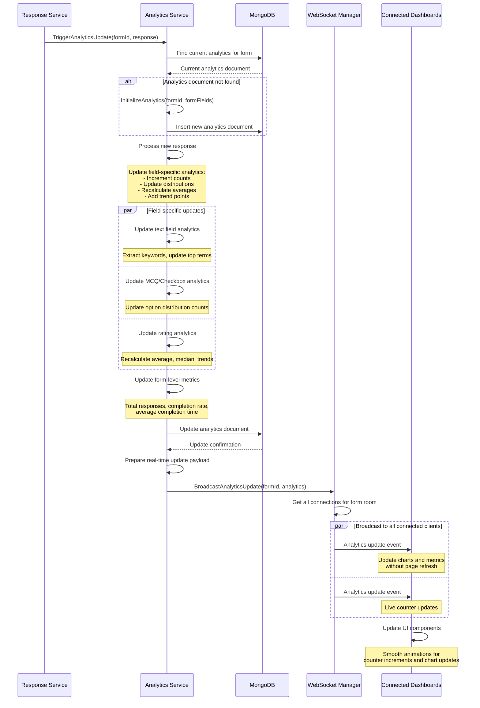
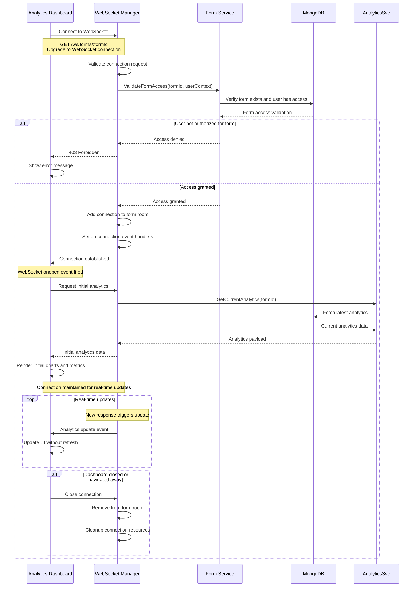
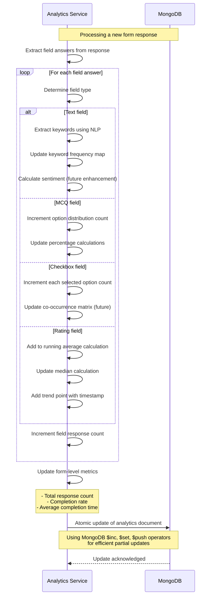
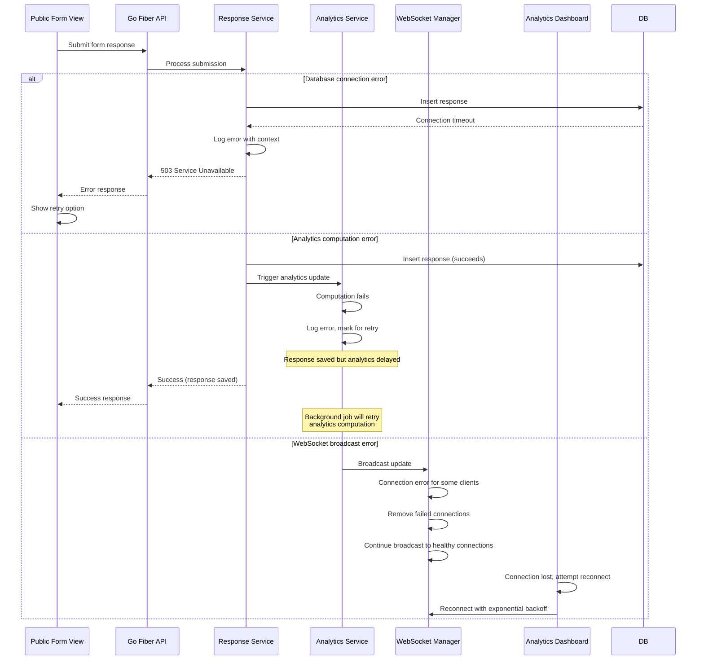

# Form Submission & Real-time Analytics Flow

## Overview

This document describes the complete flow from form submission to real-time analytics updates, showcasing how Dune Form Analytics processes responses and broadcasts live updates to connected dashboards via WebSocket.

## Form Submission Flow



## Real-time Analytics Computation



## WebSocket Connection Management



## Analytics Data Processing



## Error Handling & Resilience



## Performance Optimization

### Efficient Analytics Updates
- **Incremental Computation**: Only recalculate changed metrics
- **Atomic Operations**: MongoDB atomic updates prevent race conditions
- **Background Processing**: Heavy computations run asynchronously
- **Caching Strategy**: Frequently accessed analytics cached in memory

### WebSocket Optimization
- **Room-based Broadcasting**: Only notify relevant dashboard connections
- **Message Batching**: Combine multiple updates into single broadcast
- **Connection Pooling**: Efficient management of WebSocket connections
- **Automatic Reconnection**: Client-side reconnection with backoff

### Database Performance
- **Compound Indexes**: Optimized queries for form-response relationships
- **Aggregation Pipelines**: Efficient bulk analytics computation
- **Connection Pooling**: Optimal database connection management
- **Write Batching**: Batch multiple analytics updates when possible

## Real-time Update Types

### Analytics Update Events
```json
{
  "type": "analytics:update",
  "formId": "60f7b1b9e1234567890abcde",
  "payload": {
    "totalResponses": 156,
    "byField": {
      "field_1": {
        "count": 156,
        "distribution": {"opt_1": 89, "opt_2": 67}
      }
    },
    "updatedAt": "2024-01-15T14:30:00Z"
  }
}
```

### Connection Status Events
```json
{
  "type": "connection:status",
  "formId": "60f7b1b9e1234567890abcde",
  "payload": {
    "activeConnections": 3,
    "connectedAt": "2024-01-15T14:30:00Z"
  }
}
```

### Error Events
```json
{
  "type": "error",
  "payload": {
    "message": "Connection lost, attempting to reconnect...",
    "code": "CONNECTION_ERROR",
    "retry": true
  }
}
```

## Integration with Frontend

### Dashboard Component Updates
```typescript
// Real-time analytics updates
useEffect(() => {
  const ws = new WebSocket(`ws://localhost:8080/ws/forms/${formId}`);
  
  ws.onmessage = (event) => {
    const update = JSON.parse(event.data);
    
    switch (update.type) {
      case 'analytics:update':
        setAnalytics(prev => ({
          ...prev,
          ...update.payload
        }));
        break;
        
      case 'connection:status':
        setConnectionStatus(update.payload);
        break;
    }
  };
  
  return () => ws.close();
}, [formId]);
```

### Form Submission Handling
```typescript
const handleSubmit = async (formData: FormSubmission) => {
  try {
    setSubmitting(true);
    
    const response = await fetch(`/api/forms/${formId}/submit`, {
      method: 'POST',
      headers: { 'Content-Type': 'application/json' },
      body: JSON.stringify(formData),
    });
    
    if (response.ok) {
      setSubmitSuccess(true);
      // Analytics will update automatically via WebSocket
    } else {
      const errors = await response.json();
      setFormErrors(errors);
    }
  } finally {
    setSubmitting(false);
  }
};
```

---

**Related Documentation:**
- [WebSocket Implementation](../../backend/websockets.md) - Technical WebSocket details
- [Backend Overview](../../backend/overview.md#service-layer-architecture) - Service implementation details
- [API Documentation](../../backend/api-rest.md#analytics-endpoints) - Analytics API endpoints
- [Frontend Overview](../../frontend/overview.md#analytics-dashboard) - Dashboard architecture
