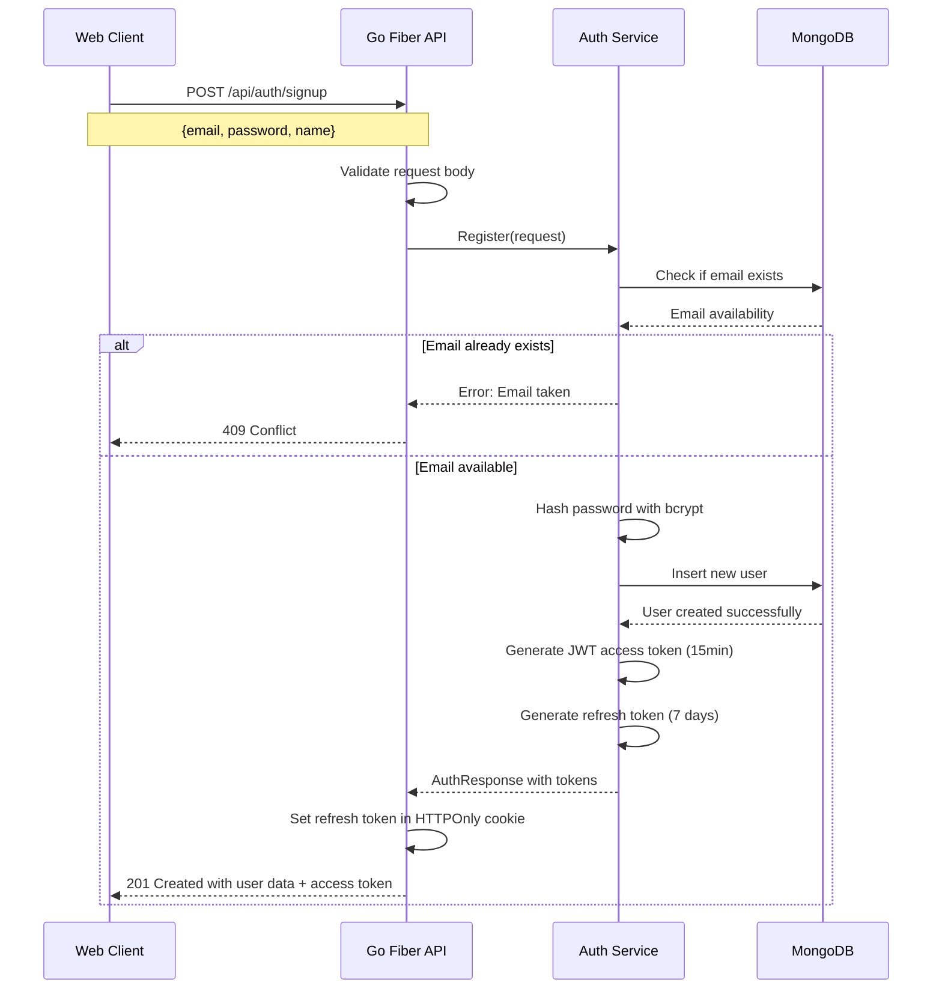
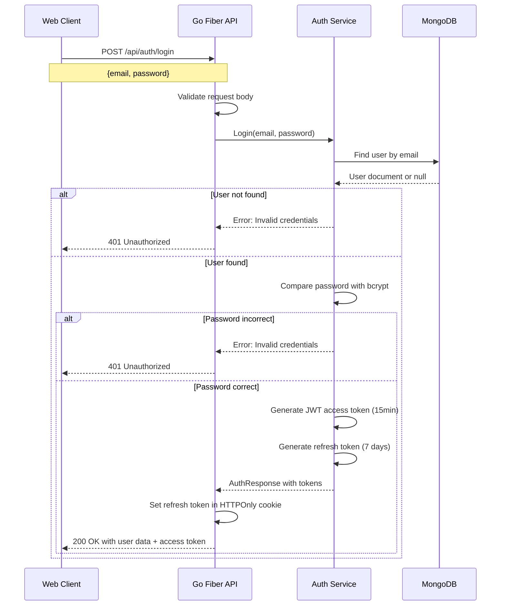
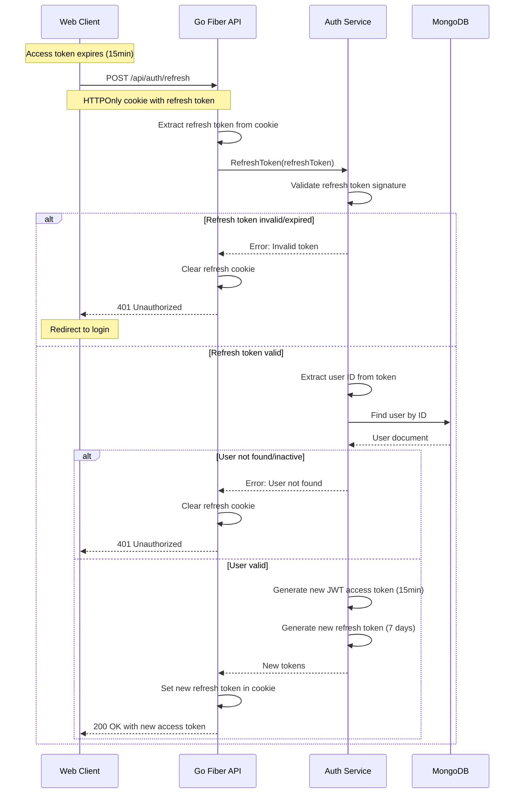
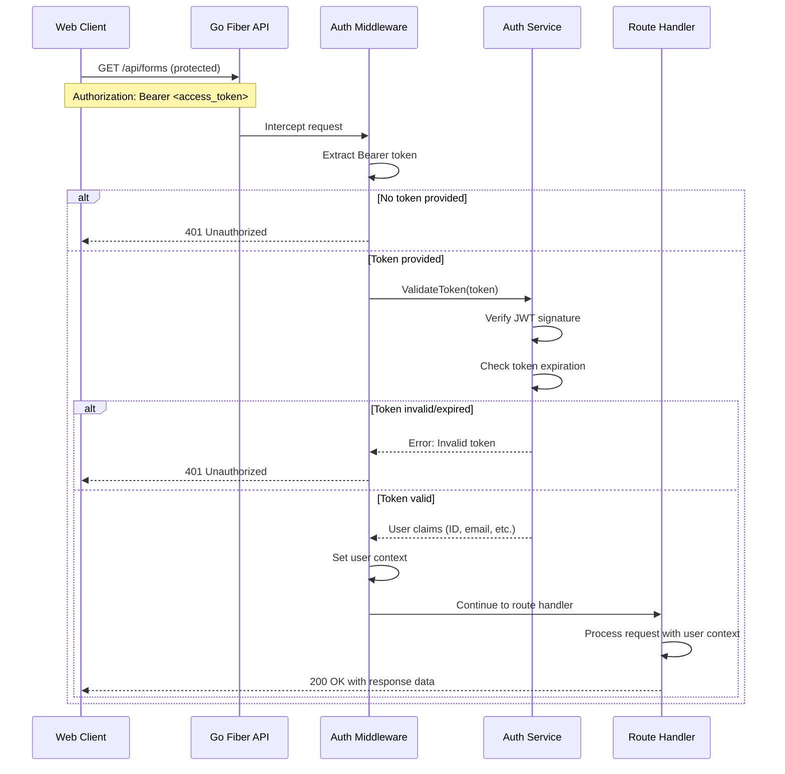
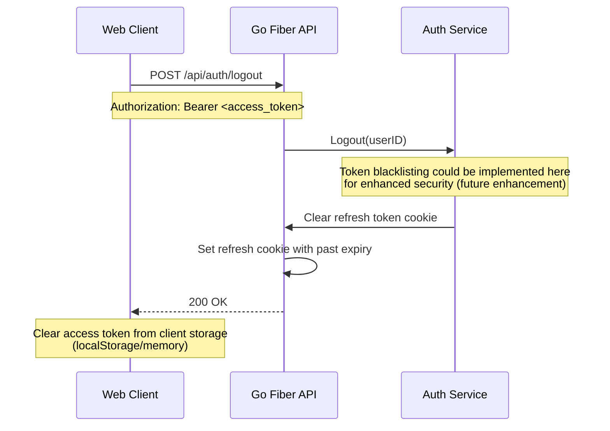
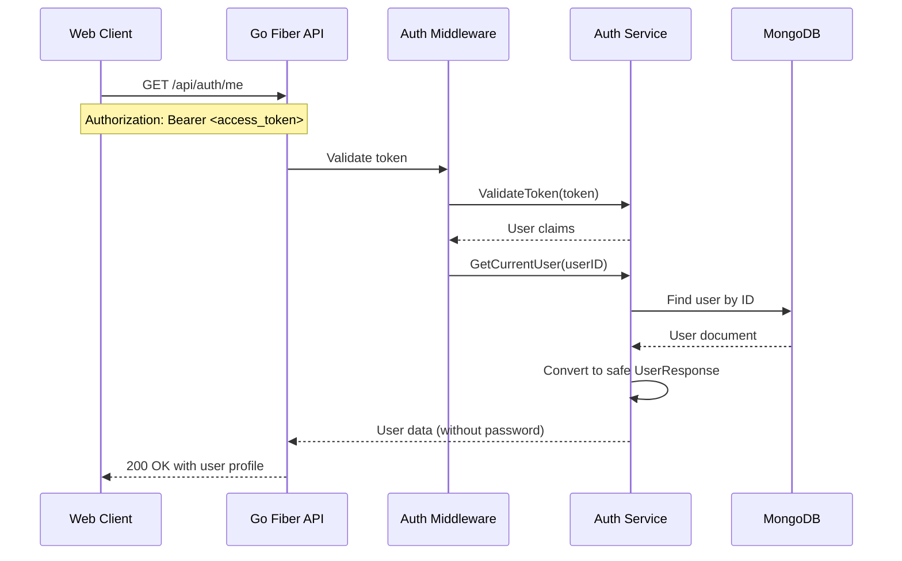

# User Authentication Flow

## Overview

This document describes the complete authentication flow in Dune Form Analytics, including user registration, login, token refresh, and logout processes using JWT-based authentication.

## Registration Flow



## Login Flow



## Token Refresh Flow



## Protected Route Access Flow



## Logout Flow



## Get Current User Flow



## Security Considerations

### Token Security
- **Access Token Lifetime**: 15 minutes to minimize exposure window
- **Refresh Token Lifetime**: 7 days with automatic rotation on use
- **HTTPOnly Cookies**: Refresh tokens stored in HTTPOnly cookies to prevent XSS
- **Secure Cookies**: HTTPS-only cookies in production environment

### Password Security
- **Bcrypt Hashing**: Strong password hashing with salt rounds
- **Password Requirements**: Minimum 6 characters (could be enhanced)
- **No Password Storage**: Passwords never returned in API responses

### API Security
- **Bearer Token Authentication**: Standard Authorization header format
- **CORS Configuration**: Restrictive cross-origin policies
- **Request Validation**: Comprehensive input validation on all endpoints

## Error Handling

### Authentication Errors
- **Invalid Credentials**: 401 Unauthorized with generic message
- **Expired Tokens**: 401 Unauthorized with token refresh instruction
- **Missing Authentication**: 401 Unauthorized for protected routes
- **Malformed Requests**: 400 Bad Request with validation errors

### Error Response Format
```json
{
  "success": false,
  "error": "Invalid credentials",
  "message": "Please check your email and password"
}
```

## Client-Side Integration

### Token Storage
```typescript
// Access token in memory or localStorage
const accessToken = localStorage.getItem('accessToken');

// Refresh token in HTTPOnly cookie (handled automatically)
// Client cannot access refresh token directly
```

### API Client Authentication
```typescript
// Automatic token attachment
const apiCall = async (url: string, options: RequestInit = {}) => {
  const token = getAccessToken();
  return fetch(url, {
    ...options,
    headers: {
      'Authorization': `Bearer ${token}`,
      'Content-Type': 'application/json',
      ...options.headers,
    },
  });
};
```

### Automatic Token Refresh
```typescript
// Intercept 401 responses and refresh token
const handleTokenRefresh = async () => {
  try {
    const response = await fetch('/api/auth/refresh', {
      method: 'POST',
      credentials: 'include', // Include HTTPOnly cookies
    });
    
    if (response.ok) {
      const { accessToken } = await response.json();
      setAccessToken(accessToken);
      return true;
    }
  } catch (error) {
    // Redirect to login page
    window.location.href = '/login';
  }
  return false;
};
```

## Performance Considerations

### JWT Validation
- **In-Memory Validation**: JWT tokens validated without database queries
- **Signature Verification**: RSA/HMAC signature validation for token integrity
- **Claim Extraction**: Efficient user ID extraction from token payload

### Database Queries
- **User Lookup Optimization**: Indexed queries on email and ObjectId
- **Minimal User Data**: Only essential fields returned in authentication responses
- **Connection Pooling**: Efficient database connection management


---

**Related Documentation:**
- [Backend Overview](../../backend/overview.md#authentication--authorization) - Security implementation
- [API Documentation](../../backend/api-rest.md#authentication-endpoints) - API endpoint documentation
- [WebSocket Security](../../backend/websockets.md#security-considerations) - Real-time security
