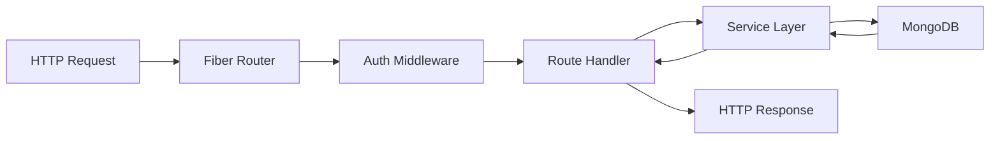
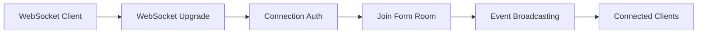

# Backend Overview

## Purpose & Architecture

The Dune Form Analytics backend is a high-performance Go API built with the Fiber framework. It provides RESTful endpoints for form management, real-time WebSocket communication for analytics updates, and robust authentication using JWT tokens.

**Core Responsibilities:**
- Form CRUD operations with ownership validation
- Anonymous form response submission and processing
- Real-time analytics computation and broadcasting
- User authentication and session management
- WebSocket-based real-time communication

## Technology Stack

### Core Technologies
| Technology | Version | Purpose |
|------------|---------|---------|
| **Go** | 1.23.0 | Primary language for performance and concurrency |
| **Fiber** | v2.52.9 | High-performance HTTP framework |
| **MongoDB Driver** | v1.12.1 | Database operations and aggregation pipelines |
| **JWT** | v5.3.0 | Authentication token management |
| **Viper** | v1.17.0 | Configuration management |
| **Uber Fx** | v1.20.0 | Dependency injection container |

### Development Tools
| Tool | Purpose |
|------|---------|
| **Swagger** | API documentation generation |
| **Air** | Live reload for development |
| **pprof** | Performance profiling |
| **Fiber Monitor** | Real-time metrics dashboard |

## Project Structure

```
apps/api/
├── cmd/
│   └── server/
│       └── main.go              # Application entry point
├── internal/
│   ├── config/
│   │   └── config.go            # Configuration management
│   ├── container/
│   │   ├── container.go         # Dependency injection setup
│   │   └── routes.go            # Route configuration
│   ├── database/
│   │   ├── connection.go        # MongoDB connection
│   │   └── migration.go         # Database initialization
│   ├── handlers/
│   │   ├── analytics_handler.go # Analytics endpoints
│   │   ├── auth_handler.go      # Authentication endpoints
│   │   ├── form_handler.go      # Form CRUD endpoints
│   │   └── response_handler.go  # Response submission
│   ├── interfaces/
│   │   └── services.go          # Service interfaces
│   ├── middleware/
│   │   ├── auth.go              # JWT authentication
│   │   └── error_handler.go     # Error handling
│   ├── models/
│   │   ├── analytics.go         # Analytics data structures
│   │   ├── form.go              # Form models
│   │   ├── response.go          # Response models
│   │   └── user.go              # User models
│   ├── realtime/
│   │   └── websocket.go         # WebSocket management
│   └── services/
│       ├── analytics_service.go # Analytics business logic
│       ├── auth_service.go      # Authentication logic
│       ├── form_service.go      # Form management logic
│       └── response_service.go  # Response processing
├── pkg/
│   └── utils/
│       ├── slug.go              # URL slug generation
│       └── validation.go        # Custom validation
└── docs/                        # Swagger documentation
```

## Core Components

### 1. Application Bootstrap (`main.go`)

```go
// Application entry point with Fx dependency injection
func main() {
    app := fx.New(
        // Configuration
        fx.Provide(config.Load),
        
        // Database
        fx.Provide(database.Connect),
        
        // Services
        fx.Provide(services.NewAuthService),
        fx.Provide(services.NewFormService),
        fx.Provide(services.NewResponseService),
        fx.Provide(services.NewAnalyticsService),
        
        // WebSocket
        fx.Provide(realtime.NewWebSocketManager),
        
        // Handlers
        fx.Provide(handlers.NewAuthHandler),
        fx.Provide(handlers.NewFormHandler),
        fx.Provide(handlers.NewResponseHandler),
        fx.Provide(handlers.NewAnalyticsHandler),
        
        // Server
        fx.Provide(container.NewFiberApp),
        fx.Invoke(container.SetupRoutes),
        fx.Invoke(container.StartServer),
    )
    
    app.Run()
}
```

### 2. Configuration Management (`config.go`)

**Environment Variables:**
```go
type Config struct {
    Environment string          `mapstructure:"environment"`
    Database    DatabaseConfig  `mapstructure:"database"`
    Server      ServerConfig    `mapstructure:"server"`
    CORS        CORSConfig      `mapstructure:"cors"`
    WebSocket   WebSocketConfig `mapstructure:"websocket"`
    Auth        AuthConfig      `mapstructure:"auth"`
}
```

**Configuration Sources:**
- Environment variables with `DUNE_` prefix
- Optional YAML configuration files
- Sensible defaults for development

### 3. Fiber Application Setup (`container.go`)

```go
func NewFiberApp(cfg *config.Config) *fiber.App {
    app := fiber.New(fiber.Config{
        AppName:      cfg.Server.AppName,
        BodyLimit:    cfg.Server.BodyLimit,
        ErrorHandler: middleware.ErrorHandler,
        JSONEncoder:  json.Marshal,
        JSONDecoder:  json.Unmarshal,
    })
    
    // Global middleware
    app.Use(cors.New(cors.Config{
        AllowOrigins:     cfg.CORS.AllowOrigins,
        AllowMethods:     cfg.CORS.AllowMethods,
        AllowHeaders:     cfg.CORS.AllowHeaders,
        AllowCredentials: cfg.CORS.AllowCredentials,
    }))
    
    app.Use(logger.New())
    app.Use(recover.New())
    
    return app
}
```

## Service Layer Architecture

### 1. Form Service (`form_service.go`)
- **Purpose**: Form CRUD operations and ownership management
- **Key Methods**:
  - `CreateForm(userID, request)` - Create new form with validation
  - `GetForm(formID, ownerID)` - Retrieve form with access control
  - `UpdateForm(formID, updates, ownerID)` - Update form fields/metadata
  - `PublishForm(formID, ownerID)` - Make form publicly accessible
  - `GetPublicForm(slug)` - Retrieve published form by slug

### 2. Response Service (`response_service.go`)
- **Purpose**: Handle form response submission and validation
- **Key Methods**:
  - `SubmitResponse(formID, request)` - Process anonymous submissions
  - `GetResponses(formID, ownerID, pagination)` - Retrieve responses
  - `ExportCSV(formID, ownerID)` - Generate CSV export
  - `ValidateResponse(form, answers)` - Schema validation

### 3. Analytics Service (`analytics_service.go`)
- **Purpose**: Compute and manage form analytics
- **Key Methods**:
  - `GetAnalytics(formID, ownerID)` - Retrieve current analytics
  - `ComputeAnalytics(formID, dateRange, fields)` - Full recomputation
  - `UpdateAnalyticsIncremental(formID, response)` - Real-time updates
  - `GetTrendAnalytics(formID, period)` - Historical trend analysis

### 4. Auth Service (`auth_service.go`)
- **Purpose**: User authentication and JWT management
- **Key Methods**:
  - `Register(email, password, name)` - User registration with bcrypt
  - `Login(email, password)` - Authentication with token generation
  - `RefreshToken(refreshToken)` - Token renewal with rotation
  - `ValidateToken(token)` - JWT signature validation

### 5. WebSocket Service (`websocket.go`)
- **Purpose**: Real-time communication management
- **Key Methods**:
  - `HandleConnection(formID)` - WebSocket upgrade and auth
  - `BroadcastToRoom(formID, message)` - Room-based messaging
  - `GetRoomCount(formID)` - Connection statistics
  - `CleanupConnection(conn)` - Resource cleanup

## Request/Response Flow

### 1. HTTP Request Processing



### 2. WebSocket Connection Flow



## Data Access Patterns

### 1. MongoDB Integration

```go
// Connection setup with proper pooling
func Connect(cfg *config.Config) (*database.Collections, error) {
    clientOptions := options.Client().ApplyURI(cfg.Database.URI)
    clientOptions.SetMaxPoolSize(100)
    clientOptions.SetMaxConnIdleTime(30 * time.Second)
    
    client, err := mongo.Connect(context.Background(), clientOptions)
    if err != nil {
        return nil, err
    }
    
    db := client.Database("dune_forms")
    
    return &database.Collections{
        Forms:     db.Collection("forms"),
        Responses: db.Collection("responses"),
        Users:     db.Collection("users"),
        Analytics: db.Collection("analytics"),
    }, nil
}
```

### 2. Aggregation Pipeline Usage

```go
// Example: Trend analytics computation
pipeline := []bson.M{
    {"$match": bson.M{
        "formId": objectID,
        "submittedAt": bson.M{
            "$gte": startDate,
            "$lte": endDate,
        },
    }},
    {"$group": bson.M{
        "_id": bson.M{
            "$dateToString": bson.M{
                "format": "%Y-%m-%d",
                "date":   "$submittedAt",
            },
        },
        "count": bson.M{"$sum": 1},
    }},
    {"$sort": bson.M{"_id": 1}},
}
```

## Authentication & Authorization

### 1. JWT Token Strategy

```go
// Token generation with proper claims
func (s *AuthService) generateTokens(user *models.User) (*models.AuthResponse, error) {
    // Access token (15 minutes)
    accessClaims := jwt.MapClaims{
        "sub":  user.ID.Hex(),
        "email": user.Email,
        "iat":  time.Now().Unix(),
        "exp":  time.Now().Add(15 * time.Minute).Unix(),
        "type": "access",
    }
    
    // Refresh token (7 days)
    refreshClaims := jwt.MapClaims{
        "sub":  user.ID.Hex(),
        "iat":  time.Now().Unix(),
        "exp":  time.Now().Add(7 * 24 * time.Hour).Unix(),
        "type": "refresh",
    }
    
    // Sign tokens with different secrets
    accessToken := jwt.NewWithClaims(jwt.SigningMethodHS256, accessClaims)
    refreshToken := jwt.NewWithClaims(jwt.SigningMethodHS256, refreshClaims)
    
    // Return signed tokens...
}
```

### 2. Middleware Implementation

```go
// JWT validation middleware
func AuthMiddleware(authService *services.AuthService) fiber.Handler {
    return func(c *fiber.Ctx) error {
        authHeader := c.Get("Authorization")
        if !strings.HasPrefix(authHeader, "Bearer ") {
            return c.Status(401).JSON(fiber.Map{
                "success": false,
                "error":   "Missing or invalid authorization header",
            })
        }
        
        token := strings.TrimPrefix(authHeader, "Bearer ")
        claims, err := authService.ValidateToken(token)
        if err != nil {
            return c.Status(401).JSON(fiber.Map{
                "success": false,
                "error":   "Invalid token",
            })
        }
        
        // Set user context
        c.Locals("userID", claims["sub"])
        c.Locals("userEmail", claims["email"])
        
        return c.Next()
    }
}
```

## Error Handling

### 1. Centralized Error Handler

```go
func ErrorHandler(c *fiber.Ctx, err error) error {
    code := fiber.StatusInternalServerError
    message := "Internal Server Error"
    
    // Handle Fiber errors
    if e, ok := err.(*fiber.Error); ok {
        code = e.Code
        message = e.Message
    }
    
    // Handle validation errors
    if validationErrs, ok := err.(validator.ValidationErrors); ok {
        code = fiber.StatusBadRequest
        return c.Status(code).JSON(fiber.Map{
            "success": false,
            "error":   "Validation failed",
            "details": formatValidationErrors(validationErrs),
        })
    }
    
    // Log error with context
    log.Error().
        Err(err).
        Int("status", code).
        Str("method", c.Method()).
        Str("path", c.Path()).
        Msg("Request failed")
    
    return c.Status(code).JSON(fiber.Map{
        "success": false,
        "error":   message,
    })
}
```

### 2. Business Logic Error Handling

```go
// Service-level error handling with context
func (s *FormService) GetForm(ctx context.Context, formID, ownerID string) (*models.FormResponse, error) {
    objectID, err := primitive.ObjectIDFromHex(formID)
    if err != nil {
        return nil, fmt.Errorf("invalid form ID format: %w", err)
    }
    
    filter := bson.M{"_id": objectID}
    if ownerID != "" {
        filter["ownerId"] = ownerID
    }
    
    var form models.Form
    err = s.collections.Forms.FindOne(ctx, filter).Decode(&form)
    if err != nil {
        if err == mongo.ErrNoDocuments {
            return nil, fmt.Errorf("form not found or access denied")
        }
        return nil, fmt.Errorf("database query failed: %w", err)
    }
    
    return form.ToResponse(), nil
}
```

## Performance Considerations

### 1. Database Optimization
- **Connection Pooling**: 100 max connections with 30s idle timeout
- **Indexes**: Strategic indexing on commonly queried fields
- **Aggregation Pipelines**: Efficient analytics computation
- **Document Size**: Optimized field structures for performance

### 2. Memory Management
- **Goroutine Limits**: Proper WebSocket connection limits
- **Buffer Sizes**: Configurable WebSocket buffer sizes
- **Context Timeouts**: Request-level timeouts for long operations
- **Resource Cleanup**: Proper defer statements and connection cleanup

### 3. Concurrent Processing
- **Goroutine Pools**: Worker pools for analytics computation
- **Channel Communication**: Safe concurrent operations
- **Mutex Protection**: Critical section protection for WebSocket rooms
- **Atomic Operations**: Thread-safe counter updates

## Development Tools Integration

### 1. Swagger Documentation
```go
// Swagger annotations in handlers
// @Summary Create new form
// @Description Create a new form with fields and validation
// @Tags Forms
// @Accept json
// @Produce json
// @Param form body models.CreateFormRequest true "Form data"
// @Success 201 {object} models.FormResponse
// @Failure 400 {object} fiber.Map
// @Failure 401 {object} fiber.Map
// @Router /api/forms [post]
// @Security BearerAuth
func (h *FormHandler) CreateForm(c *fiber.Ctx) error {
    // Implementation...
}
```

### 2. Performance Monitoring
```go
// Built-in Fiber monitor middleware
app.Get("/monitor", monitor.New(monitor.Config{
    Title: "Dune Form Analytics API Monitor",
}))

// Go pprof integration
app.Use("/debug/pprof", pprof.New())
```

### 3. Live Reload with Air
```toml
# .air.toml configuration
[build]
  cmd = "go build -o ./tmp/main cmd/server/main.go"
  bin = "./tmp/main"
  full_bin = "APP_ENV=dev ./tmp/main"
  include_ext = ["go", "tpl", "tmpl", "html"]
  exclude_dir = ["tmp", "vendor", "testdata"]
```

## Security Implementation

### 1. Input Validation
- **Request Validation**: Comprehensive struct tag validation
- **SQL Injection Prevention**: Parameterized MongoDB queries
- **XSS Prevention**: JSON encoding/decoding security
- **File Upload Security**: Proper MIME type validation

### 2. Authentication Security
- **Password Hashing**: bcrypt with proper salt rounds
- **Token Security**: Strong secret keys (32+ characters)
- **Token Rotation**: Automatic refresh token rotation
- **Session Management**: Stateless JWT with proper expiration

### 3. API Security
- **Rate Limiting**: Connection and request limits (future enhancement)
- **CORS Configuration**: Restrictive cross-origin policies
- **HTTPS Only**: TLS enforcement in production
- **Header Security**: Proper security headers implementation

## Deployment Configuration

### 1. Environment-specific Settings
```go
// Production configuration
production := &Config{
    Environment: "production",
    Database: DatabaseConfig{
        URI: "mongodb://prod-cluster/dune_forms",
    },
    Server: ServerConfig{
        Port: "8080",
        BodyLimit: 10 * 1024 * 1024, // 10MB
    },
    Auth: AuthConfig{
        AccessTokenSecret:  os.Getenv("ACCESS_TOKEN_SECRET"),
        RefreshTokenSecret: os.Getenv("REFRESH_TOKEN_SECRET"),
    },
}
```

### 2. Health Check Implementation
```go
// Comprehensive health check
func (h *HealthHandler) Check(c *fiber.Ctx) error {
    // Database connectivity check
    if err := h.db.HealthCheck(); err != nil {
        return c.Status(503).JSON(fiber.Map{
            "status":    "unhealthy",
            "service":   "dune-form-analytics-api",
            "timestamp": time.Now().UTC(),
            "error":     err.Error(),
        })
    }
    
    return c.JSON(fiber.Map{
        "status":    "healthy",
        "service":   "dune-form-analytics-api",
        "version":   "1.0.0",
        "timestamp": time.Now().UTC(),
    })
}
```

---

**Related Documentation:**
- [API Documentation](api-rest.md) - Complete endpoint specifications
- [WebSocket Implementation](websockets.md) - Real-time communication
- [System Architecture](../architecture/overview.md) - Overall system design
- [Data Model](../architecture/data-model.md) - Database structure
