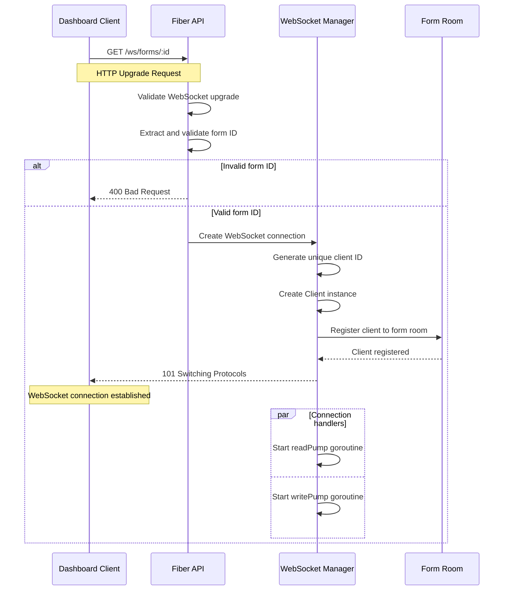

# WebSocket Real-time Communication

## Overview

The WebSocket system in Dune Form Analytics enables real-time communication between the backend and frontend for live analytics updates. When a form receives new responses, analytics are computed and immediately broadcast to all connected dashboard clients.

**Key Features:**
- **Room-based Messaging**: Clients connect to form-specific rooms
- **Real-time Analytics**: Live updates when responses are submitted
- **Connection Management**: Automatic cleanup and health monitoring
- **Concurrent Safety**: Thread-safe operations with proper synchronization
- **Error Recovery**: Graceful handling of connection failures

## Architecture

### WebSocket Manager Structure

```go
type WebSocketManager struct {
    // Registered clients grouped by form ID
    rooms      map[string]map[*Client]bool
    
    // Channels for client lifecycle
    register   chan *Client
    unregister chan *Client
    broadcast  chan *Message
    
    // Thread safety
    mutex sync.RWMutex
}
```

### Client Structure

```go
type Client struct {
    ID      string              // Unique client identifier
    FormID  string              // Form room identifier
    Conn    *websocket.Conn     // WebSocket connection
    Send    chan []byte         // Outbound message channel
    Manager *WebSocketManager   // Reference to manager
}
```

## Connection Flow

### WebSocket Handshake



### Connection Endpoint

**Endpoint**: `GET /ws/forms/:id`  
**Protocol**: WebSocket upgrade from HTTP  
**Authentication**: Optional (TODO: implement token-based auth)  

**Connection Parameters:**
- `id` (path parameter): Form ObjectId (24-character hex string)

**Connection Headers:**
```http
Upgrade: websocket
Connection: Upgrade
Sec-WebSocket-Key: <client-key>
Sec-WebSocket-Version: 13
Origin: http://localhost:3000
```

**Connection Success Response:**
```http
HTTP/1.1 101 Switching Protocols
Upgrade: websocket
Connection: Upgrade
Sec-WebSocket-Accept: <server-key>
```

## Message Types

### Analytics Update Message

Sent when form receives new responses and analytics are recomputed.

```json
{
  "type": "analytics:update",
  "formId": "60f7b1b9e1234567890abcde",
  "data": {
    "totalResponses": 156,
    "byField": {
      "field_1": {
        "count": 156,
        "distribution": {"opt_1": 89, "opt_2": 67}
      },
      "field_2": {
        "count": 142,
        "average": 3.8,
        "median": 4.0
      }
    },
    "updatedAt": "2024-01-15T14:30:00Z"
  }
}
```

### Connection Status Message

Sent when client successfully connects or on status changes.

```json
{
  "type": "connection:status",
  "formId": "60f7b1b9e1234567890abcde",
  "data": {
    "status": "connected",
    "clientId": "abc123def456",
    "activeConnections": 3,
    "connectedAt": "2024-01-15T14:30:00Z"
  }
}
```

### Real-time Metrics Message

Sent periodically with live form metrics.

```json
{
  "type": "metrics:update",
  "formId": "60f7b1b9e1234567890abcde",
  "data": {
    "responsesToday": 12,
    "responsesThisHour": 3,
    "activeViewers": 2,
    "lastSubmission": "2024-01-15T14:25:00Z"
  }
}
```

### Error Message

Sent when errors occur during connection or message processing.

```json
{
  "type": "error",
  "formId": "60f7b1b9e1234567890abcde",
  "data": {
    "code": "INVALID_MESSAGE",
    "message": "Invalid message format received",
    "timestamp": "2024-01-15T14:30:00Z"
  }
}
```

## Room Management

### Room-based Architecture

Each form has its own "room" where connected dashboard clients receive updates:

```go
// Room structure in WebSocket manager
rooms: map[string]map[*Client]bool
// Key: FormID, Value: Set of connected clients
```

### Client Registration

```go
func (w *WebSocketManager) registerClient(client *Client) {
    w.mutex.Lock()
    defer w.mutex.Unlock()
    
    // Create room if it doesn't exist
    if w.rooms[client.FormID] == nil {
        w.rooms[client.FormID] = make(map[*Client]bool)
        log.Printf("INFO: Created new room for form %s", client.FormID)
    }
    
    // Add client to room
    w.rooms[client.FormID][client] = true
    
    // Start client message handlers
    go client.readPump()
    go client.writePump()
    
    log.Printf("INFO: Client %s joined room %s (%d total clients)", 
        client.ID, client.FormID, len(w.rooms[client.FormID]))
}
```

### Client Deregistration

```go
func (w *WebSocketManager) unregisterClient(client *Client) {
    w.mutex.Lock()
    defer w.mutex.Unlock()
    
    if clients, exists := w.rooms[client.FormID]; exists {
        if _, ok := clients[client]; ok {
            delete(clients, client)
            close(client.Send)
            
            // Clean up empty rooms
            if len(clients) == 0 {
                delete(w.rooms, client.FormID)
                log.Printf("INFO: Removed empty room for form %s", client.FormID)
            }
        }
    }
    
    log.Printf("INFO: Client %s left room %s", client.ID, client.FormID)
}
```

## Message Broadcasting

### Broadcast to Form Room

```go
func (w *WebSocketManager) BroadcastToRoom(formID string, messageType string, data interface{}) {
    message := &Message{
        FormID: formID,
        Type:   messageType,
        Data:   data,
    }
    
    // Send to broadcast channel (non-blocking)
    select {
    case w.broadcast <- message:
        // Message queued successfully
    default:
        log.Printf("WARN: Broadcast channel full, dropping message for form %s", formID)
    }
}
```

### Internal Broadcast Handler

```go
func (w *WebSocketManager) broadcastToRoom(message *Message) {
    w.mutex.RLock()
    clients, exists := w.rooms[message.FormID]
    w.mutex.RUnlock()
    
    if !exists || len(clients) == 0 {
        return // No clients in this room
    }
    
    // Serialize message once
    messageBytes, err := json.Marshal(message)
    if err != nil {
        log.Printf("ERROR: Failed to marshal message: %v", err)
        return
    }
    
    // Broadcast to all clients in room
    for client := range clients {
        select {
        case client.Send <- messageBytes:
            // Message sent successfully
        default:
            // Client send channel full, remove client
            w.UnregisterClient(client)
        }
    }
}
```

## Connection Lifecycle

### Client Message Handling

#### Read Pump (Incoming Messages)

```go
func (c *Client) readPump() {
    defer func() {
        c.Manager.UnregisterClient(c)
        c.Conn.Close()
    }()
    
    // Set read deadline and pong handler
    c.Conn.SetReadDeadline(time.Now().Add(60 * time.Second))
    c.Conn.SetPongHandler(func(string) error {
        c.Conn.SetReadDeadline(time.Now().Add(60 * time.Second))
        return nil
    })
    
    for {
        _, message, err := c.Conn.ReadMessage()
        if err != nil {
            if websocket.IsUnexpectedCloseError(err, websocket.CloseGoingAway, websocket.CloseAbnormalClosure) {
                log.Printf("ERROR: WebSocket error for client %s: %v", c.ID, err)
            }
            break
        }
        
        // Handle incoming message (currently not implemented)
        log.Printf("DEBUG: Received message from client %s: %s", c.ID, string(message))
    }
}
```

#### Write Pump (Outgoing Messages)

```go
func (c *Client) writePump() {
    ticker := time.NewTicker(54 * time.Second) // Ping interval
    defer func() {
        ticker.Stop()
        c.Conn.Close()
    }()
    
    for {
        select {
        case message, ok := <-c.Send:
            c.Conn.SetWriteDeadline(time.Now().Add(10 * time.Second))
            if !ok {
                // Channel closed, send close message
                c.Conn.WriteMessage(websocket.CloseMessage, []byte{})
                return
            }
            
            // Send message to client
            if err := c.Conn.WriteMessage(websocket.TextMessage, message); err != nil {
                log.Printf("ERROR: Failed to write message to client %s: %v", c.ID, err)
                return
            }
            
        case <-ticker.C:
            // Send ping to keep connection alive
            c.Conn.SetWriteDeadline(time.Now().Add(10 * time.Second))
            if err := c.Conn.WriteMessage(websocket.PingMessage, nil); err != nil {
                return
            }
        }
    }
}
```

## Integration with Analytics Service

### Triggering Real-time Updates

The Analytics Service triggers WebSocket broadcasts when new responses are processed:

```go
// In AnalyticsService.UpdateAnalyticsIncremental
func (s *AnalyticsService) UpdateAnalyticsIncremental(ctx context.Context, formID primitive.ObjectID, response *models.Response, form *models.Form) (*models.Analytics, error) {
    // ... update analytics logic ...
    
    // Broadcast update to WebSocket clients
    if s.wsManager != nil {
        updateData := models.NewAnalyticsUpdate(formID.Hex(), analytics.ByField)
        s.wsManager.BroadcastToRoom(formID.Hex(), "analytics:update", updateData)
    }
    
    return &analytics, nil
}
```

### Response Submission Integration

```go
// In ResponseHandler.SubmitResponse
func (h *ResponseHandler) SubmitResponse(c *fiber.Ctx) error {
    // ... submit response logic ...
    
    // Trigger analytics update which will broadcast via WebSocket
    go func() {
        _, err := h.analyticsService.UpdateAnalyticsIncremental(
            context.Background(), 
            objectID, 
            response, 
            form,
        )
        if err != nil {
            log.Printf("ERROR: Failed to update analytics: %v", err)
        }
    }()
    
    return c.Status(201).JSON(/* ... */)
}
```

## Error Handling & Recovery

### Connection Error Handling

```go
func (c *Client) handleConnectionError(err error) {
    if websocket.IsUnexpectedCloseError(err, 
        websocket.CloseGoingAway,
        websocket.CloseAbnormalClosure,
        websocket.CloseNormalClosure) {
        log.Printf("ERROR: Unexpected WebSocket close for client %s: %v", c.ID, err)
    } else {
        log.Printf("INFO: WebSocket closed normally for client %s", c.ID)
    }
    
    // Cleanup will be handled by deferred functions
}
```

### Broadcast Error Recovery

```go
func (w *WebSocketManager) safeBroadcast(formID string, messageType string, data interface{}) {
    defer func() {
        if r := recover(); r != nil {
            log.Printf("ERROR: Panic in WebSocket broadcast: %v", r)
        }
    }()
    
    w.BroadcastToRoom(formID, messageType, data)
}
```

### Channel Management

```go
func (w *WebSocketManager) isChannelHealthy() bool {
    return len(w.broadcast) < cap(w.broadcast) // Channel not full
}

func (w *WebSocketManager) handleChannelOverflow() {
    log.Printf("WARN: WebSocket broadcast channel at capacity (%d messages)", cap(w.broadcast))
    // Could implement message prioritization or client throttling here
}
```

## Performance & Monitoring

### Connection Statistics

```go
func (w *WebSocketManager) GetConnectionStats() map[string]interface{} {
    w.mutex.RLock()
    defer w.mutex.RUnlock()
    
    totalConnections := 0
    roomStats := make(map[string]int)
    
    for formID, clients := range w.rooms {
        count := len(clients)
        totalConnections += count
        roomStats[formID] = count
    }
    
    return map[string]interface{}{
        "totalConnections": totalConnections,
        "totalRooms":       len(w.rooms),
        "roomStats":        roomStats,
        "channelUsage": map[string]int{
            "broadcast": len(w.broadcast),
            "register":  len(w.register),
            "unregister": len(w.unregister),
        },
    }
}
```

### Health Monitoring

```go
func (w *WebSocketManager) periodicHealthCheck() {
    ticker := time.NewTicker(5 * time.Minute)
    defer ticker.Stop()
    
    for range ticker.C {
        stats := w.GetConnectionStats()
        log.Printf("INFO: WebSocket health - %v", stats)
        
        // Alert if channels are backing up
        if stats["channelUsage"].(map[string]int)["broadcast"] > 200 {
            log.Printf("WARN: WebSocket broadcast channel backing up")
        }
    }
}
```

## Configuration

### WebSocket Configuration

```go
// In WebSocket handler setup
websocket.Config{
    Origins:         []string{"http://localhost:3000", "http://127.0.0.1:3000"},
    WriteBufferSize: 1024,
    ReadBufferSize:  1024,
    CheckOrigin: func(c *fiber.Ctx) bool {
        return true // TODO: implement proper origin validation
    },
}
```

### Environment Variables

| Variable | Description | Default |
|----------|-------------|---------|
| `DUNE_WEBSOCKET_BUFFER_SIZE` | Message buffer size | 256 |
| `DUNE_WEBSOCKET_READ_BUFFER_SIZE` | Read buffer size | 1024 |
| `DUNE_WEBSOCKET_WRITE_BUFFER_SIZE` | Write buffer size | 1024 |

## Client-side Integration

### Frontend WebSocket Client

```typescript
class FormAnalyticsWebSocket {
    private ws: WebSocket | null = null;
    private formId: string;
    private reconnectAttempts = 0;
    private maxReconnectAttempts = 5;
    
    constructor(formId: string) {
        this.formId = formId;
        this.connect();
    }
    
    private connect() {
        const wsUrl = `ws://localhost:8080/ws/forms/${this.formId}`;
        this.ws = new WebSocket(wsUrl);
        
        this.ws.onopen = () => {
            console.log('WebSocket connected');
            this.reconnectAttempts = 0;
        };
        
        this.ws.onmessage = (event) => {
            const message = JSON.parse(event.data);
            this.handleMessage(message);
        };
        
        this.ws.onclose = () => {
            console.log('WebSocket closed');
            this.attemptReconnect();
        };
        
        this.ws.onerror = (error) => {
            console.error('WebSocket error:', error);
        };
    }
    
    private handleMessage(message: any) {
        switch (message.type) {
            case 'analytics:update':
                this.onAnalyticsUpdate(message.data);
                break;
            case 'metrics:update':
                this.onMetricsUpdate(message.data);
                break;
            case 'error':
                this.onError(message.data);
                break;
        }
    }
    
    private attemptReconnect() {
        if (this.reconnectAttempts < this.maxReconnectAttempts) {
            const delay = Math.pow(2, this.reconnectAttempts) * 1000;
            setTimeout(() => {
                this.reconnectAttempts++;
                this.connect();
            }, delay);
        }
    }
}
```

## Security Considerations

### Authentication (Future Enhancement)

```go
// TODO: Implement WebSocket authentication
func (w *WebSocketManager) authenticateConnection(c *fiber.Ctx) (*models.User, error) {
    token := c.Query("token") // or from header
    if token == "" {
        return nil, fmt.Errorf("authentication token required")
    }
    
    // Validate JWT token
    user, err := w.authService.ValidateToken(token)
    if err != nil {
        return nil, fmt.Errorf("invalid token: %w", err)
    }
    
    return user, nil
}
```

### Origin Validation

```go
func validateOrigin(c *fiber.Ctx) bool {
    origin := c.Get("Origin")
    allowedOrigins := []string{
        "http://localhost:3000",
        "https://yourapp.com",
    }
    
    for _, allowed := range allowedOrigins {
        if origin == allowed {
            return true
        }
    }
    
    return false
}
```

### Rate Limiting (Future Enhancement)

```go
type ConnectionLimiter struct {
    limits map[string]time.Time // IP -> last connection time
    mutex  sync.RWMutex
}

func (cl *ConnectionLimiter) AllowConnection(ip string) bool {
    cl.mutex.RLock()
    lastConn, exists := cl.limits[ip]
    cl.mutex.RUnlock()
    
    if exists && time.Since(lastConn) < time.Second {
        return false // Rate limited
    }
    
    cl.mutex.Lock()
    cl.limits[ip] = time.Now()
    cl.mutex.Unlock()
    
    return true
}
```

## Troubleshooting

### Common Issues

**Connection Refused:**
- Check if WebSocket endpoint is available: `ws://localhost:8080/ws/forms/{formId}`
- Verify form ID format (24-character hex string)
- Ensure CORS origins are configured correctly

**Messages Not Received:**
- Check if client is in correct room (form ID matches)
- Verify WebSocket connection is still open
- Check server logs for broadcast errors

**Memory Leaks:**
- Monitor goroutine count: connections should clean up properly
- Check for unclosed channels in client cleanup
- Verify room cleanup when no clients remain

### Debug Commands

```bash
# Check WebSocket connection
wscat -c ws://localhost:8080/ws/forms/60f7b1b9e1234567890abcde

# Monitor connection stats
curl http://localhost:8080/api/ws/stats

# Check specific form room
curl http://localhost:8080/api/ws/stats?formId=60f7b1b9e1234567890abcde
```

---

**Related Documentation:**
- [Real-time Analytics Sequence](../architecture/sequences/form-submission-analytics.md) - Complete flow documentation
- [Frontend Overview](../frontend/overview.md#websocket-integration) - Client-side implementation
- [Backend Overview](overview.md#websocket-service) - Service architecture context
